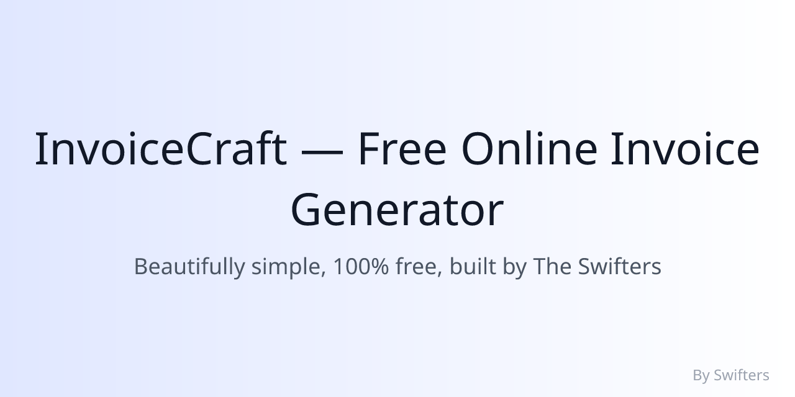

# 🧾 InvoiceCraft — Free Online Invoice Generator
*A modern, open-source invoice and document generator built by The Swifters using Next.js, Tailwind, and MongoDB.*



**Badges:**
Next.js • TailwindCSS • MongoDB • NextAuth • Vercel • MIT License • Made with ❤️ by The Swifters

---

### 📖 Overview
InvoiceCraft is a free, modern, and visually minimal invoice and document generator.
It allows freelancers, small businesses, and individuals to create and download professional invoices, receipts, and quotes instantly — all for free.

No subscriptions, no paywalls — just simplicity and design excellence.
Built with performance, SEO, and scalability in mind.

---

### 🚀 Features
- ✅ Professional Invoice Builder (with logo upload, editable fields, auto-calculations)
- ✅ Save & Manage Invoices (MongoDB + NextAuth)
- ✅ Client Book (store frequent client details)
- ✅ Dashboard (view and manage saved invoices)
- ✅ Receipt, Quote & Estimate Templates
- ✅ Free Business Tools (currency converter, PDF tools — placeholders ready)
- ✅ Fully Responsive Design (mobile & desktop)
- ✅ Multi-language Ready
- ✅ SEO-optimized (sitemap, robots.txt, structured data)
- ✅ AdSense-ready placeholders for monetization
- ✅ Modern branding and minimal UI designed by The Swifters

---

### 🧰 Tech Stack
- **Frontend:** Next.js 14, React 18, TailwindCSS
- **Backend:** Next.js API Routes, Mongoose
- **Database:** MongoDB Atlas
- **Auth:** NextAuth (Google + Email)
- **File Export:** html2canvas + jsPDF
- **Hosting:** Vercel
- **Analytics & Monetization:** Google Analytics + AdSense placeholders

---

### ⚙️ Setup Instructions

```bash
# Clone the repository
git clone https://github.com/The-Swifters/invoicecraft.git

# Navigate into the project
cd invoicecraft

# Install dependencies
npm install

# Copy environment variables example
cp .env.example .env.local

# Run the development server
npm run dev
```
Visit: http://localhost:3000

### 🌍 Deployment

Deploy directly to Vercel.

Required environment variables:

```
MONGODB_URI=
NEXTAUTH_SECRET=
GOOGLE_CLIENT_ID=
GOOGLE_CLIENT_SECRET=
NEXTAUTH_URL=
```

AdSense, Analytics, and other scripts can be configured later in /src/app/layout.tsx.

### 💡 Future Enhancements

- OCR receipt scanner → auto convert to invoice
- QR code payment links (Stripe, PayPal)
- Invoice analytics & reporting dashboard
- PWA installation for offline mode
- AI text assistant for notes and payment terms
- Multi-language translation extension
- Public “Invoice Showcase” gallery

### 🧠 About The Swifters

We are a two-person creative tech team — Abdur Rafay & Faaiz — specializing in:

- UI/UX design
- Full-stack and automation development
- GoHighLevel funnels & CRM setup
- WordPress & custom web apps

Our goal: build tools that are elegant, free, and genuinely useful to everyone.

### 📄 License

This project is licensed under the MIT License — free for personal and commercial use.

### ❤️ Credits

Built with love by The Swifters
